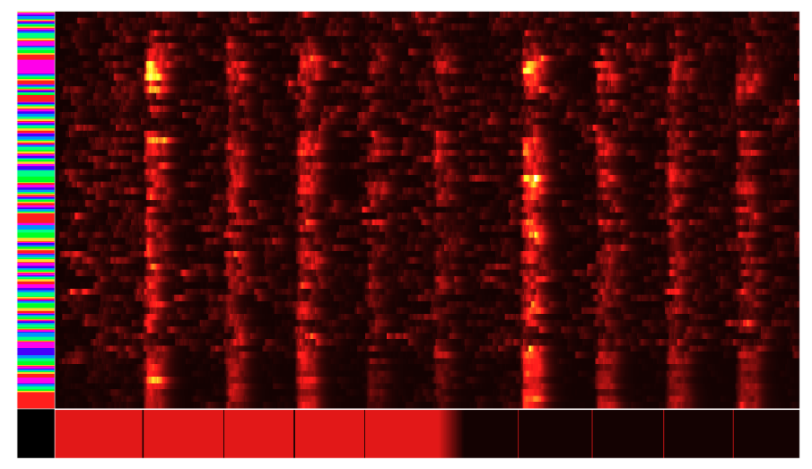
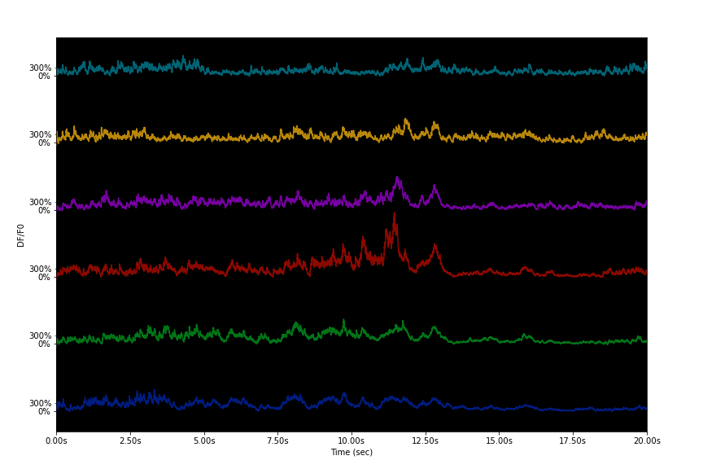
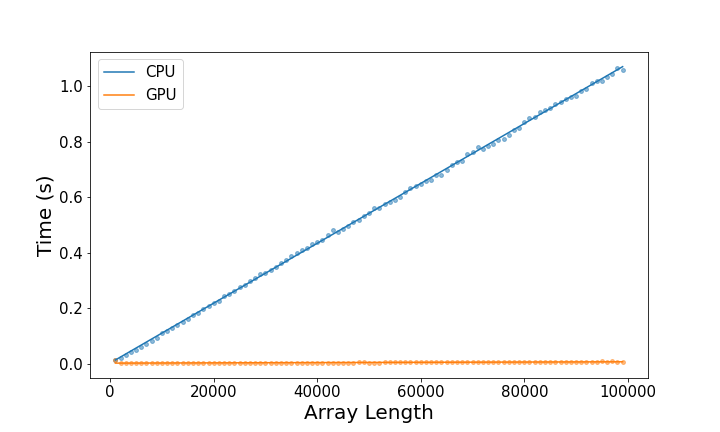
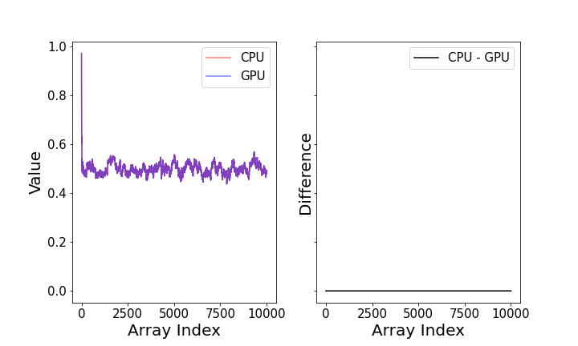

---
title: 'PyNeuroTrace: Python code for Neural Timeseries'
tags:
  - Python
  - neuroscience
  - signal processing
  - calcium imaging
  - voltage imaging
authors:
  - name: Patrick Coleman 
    orcid: 0000-0000-0000-0000
    equal-contrib: true
    affiliation: 1

  - name: Peter Hogg
    orid: 0000-0003-2176-4977
    equal-contrib: true 
    affiliation: 1

 - name: Kurt Haas
    orid: 0000-0003-4754-1560
    equal-contrib: false
    affiliation: 1
affiliations:
 - name: Department of Cellular and Physiological Sciences, Centre for Brain Health, School of Biomedical Engineering, University of British Columbia, Vancouver, Canada
   index: 1
date: 14 April 2024
bibliography: paper.bib

--- 

# Summary

Modern techniques in optophysiology have allowed neuroscientists unprecedented access to neuronal activity *in vivo*. The time series datasets generated from these experiments are becoming increasing larger as new technologies allow for faster acquistion rates of raw data. These fluorscent recordings are being made with an ever expanding library of indicators for calcium, voltage, neurotransimitter and neuromodulator activity. These signals generated from these fluorscent bioindicators contain the information of the underlying neuronal activity but all have unique molecular kinetics and inherit signal-noise ratios which must be taken into account during singal processing. The development of pyNeuroTrace, an open-source Python library, was made to aid in the processing of these neurnal signals which must be filtered with these unique aspects in mind before analysis can be completed.

# Statement of need

Many neuroscience labs that use optophysiological methods, such as two-photon microscopy or fibrephotomotery, frequently must rewrite and maintain common functions and filters needed to analysis the raw recordings. Furthermore, many technique and algorithms for signal processing are scattered throughout the literature and are frequently implemented programing languages other than Python. `pyNeuroTrace` meets the need of a time series analysis written purely in Python for neuronal activity. Our package is a collection of filters and algorithms implemented in a genralizable manner for time series data in either 1D-arrays or a collection of recording in a 2D-arrays. Additionally, with the increase in aquistion rate of new imaging techniques, we have implementations of these algorithms using GPU compatiable code to increase the speed in which the techniques can be applied to larger datasets collected at kilohertz rates.

# Signal Processing

## DeltaF/F
There are several methods for calculating the DeltaF/F of a fluorscent trace. We implemented the method described by Jia *et al* which includes several smoothing steps to help with shot noise[@Jia2010]. In short, F0 is calculated by finding a the minmum signal in a window of the rolling average of the raw signal. Then DeltaF is calculated by the difference in the raw signal and F0 divided by F0 (F-F0)/F0. This DeltaF/F signal is optionally smoothed using an exponetially wieghted moving average (ewma) to further remove shot noise. 

## Okada Filter
We implement the Okada Filter in Python[@Okada2016]. This filter is designed to filter shot-noise from traces in low-signal to noise paradigms, which is common for calcium imaging with two-photon imaging where the collected photon count is low and noise from PMT can be nontrivial. 

## Nonnegative Deconvolution
`pyNeuroTrace` also has an implementation of nonnegative deconvolution (NND) to be applied to photocurrents to reduce noise in raw time series recordings [@Podgorksi2012]. These alogrithm can also be used to aid in the detection of events associated with neuronal activity which follow similiar decays as photocurrents from detects, as small events in fluorscent imaging are often obfuscated by noise in the signal[@Podgorksi2012].

# Event Detection
TODO -> write about this. Add GPU speed up to code

# Visualization
`pyNeuroTrace` has several in built visualization tools. 2D arrays of neuronal timeseries can be displayed as heat maps \autoref{fig:heatmap} or as individual traces \autoref{fig:traces}. 

and referenced from text using \autoref{fig:heatmap}
Figures can be included like this:

and referenced from text using \autoref{fig:example}.

Figures can be included like this:

# GPU Acceleration
Several of the filters in `pyNeuroTrace` have been rewritten to be almost entirerly vectorized in their calculations. The benefit being a noticable difference in the performance for larger time series. These vectorized versions gain further speed by being excuted on a GPU using the Cupy Python library [@cupy_learningsys2017]. To excuted these versions the filters can be imported from the module, `pyneruopyneurotrace.gpu.filters`, and a CUDA compatiable graphics card is needed. This functionality is becoming increasingly important as acquisition rates increase for kilohertz imaging of activity can generate arrays hundreds of thousands of datapoints in length in just a few minutes. \autoref{fig:CPUvsGPU} shows the difference in calculating arrays of various sizes using either the CPU or vectorized GPU based approach of the dF/F function. The CPU used in these calcultions was a Intel i5-9600K with six 4.600GHz cores, the GPU was a NVIDIA GeForce RTX 4070 with CUDA Version 12.3. 

To vectorize the functions several where modified. For example the EMWA used to smooth the dF/F signal as described by Jia *et al* was changed to an approximation using convolution with an exponetional function. The kernel used to perform is defined as:

$$w[i] = \begin{cases} 
\alpha \cdot (1 - \alpha)^i & \text{for } i = 0, 1, 2, \dots, N-1 \\
0 & \text{otherwise}
\end{cases}$$

Where $\alpha$ is defined as:

$$ \alpha = 1 - e^-\frac{1}{\tau}$$
 $\tau$ where is a user selected time constant which is translated into number of samples. $N$ is a window parameter for the kernal calcuated using $\alpha$:
 $$N = \left\lfloor -\frac{\log(10^{-10})}{\alpha} \right\rfloor$$
 
This allows a filter for smaller values that have a minisclue influence on the weighted average. The kernel needs to be normalized to produce smoothing with the same output value as the non-vectorized impementation:

$$w[i] \leftarrow \frac{w[i]}{\sum_{j=0}^{N-1} w[j]}$$
The normalized kernel is then convolved with the dF/F signal, d:
$$c[k] = \sum_{i=0}^{N-1} w[i]\cdot d[k-i]$$

This convolved signal, $c$ is then normalized to the cummulative sum of the exponetial kernel:

$$n[j] = \sum_{i=0}^{j} w[i]$$

$$emwa = c[i]/n[i]$$

Differences between the CPU and GPU implenetations of the EWMA for an array of ranom values have been plotted \autoref{fig:ewmaCPUvsGPU}. These were generated from the same array using the respective decays for either implementation using the time constant of 50 miliseconds and a sampling rate of 2kHz. The difference between the two outputs typically range in magnitude from  1e-16 to 1e-12 depending on user parameters. These discrepancies can also be attributed to differences in floating point number accuracy between CPU and GPU calcultations.

# Acknowledgements

The development of this software was supported by funds from the Canadian Institutes of Health Research (CIHR) Foundation Award (FDN-148468).

# References